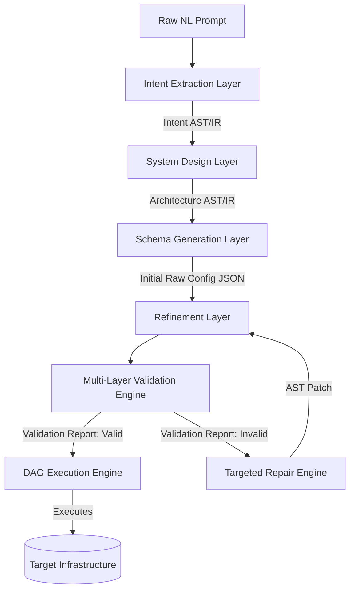
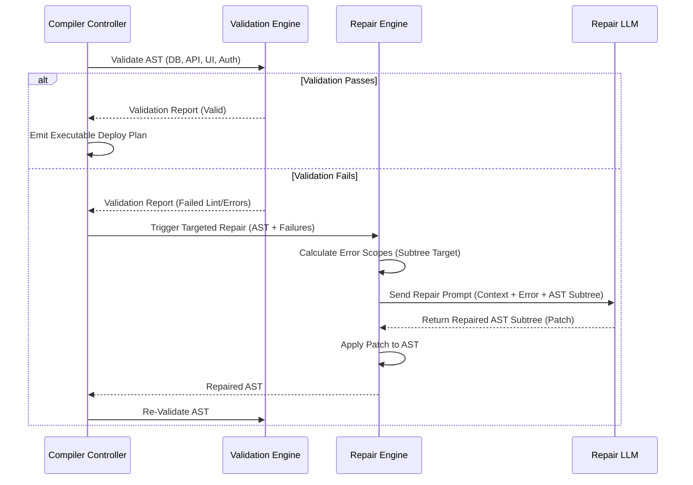

# NL-to-App Compiler: Enterprise-Grade System Design Document
**Role**: Senior AI Systems Architect & Compiler Engineer  
**Target Audience**: Technical Architects, AI Engineers, and Low-Code Platform Engineers

---

## 1. Executive Summary & Success Criteria

The **NL-to-App Compiler** is a highly reliable compiler system that converts unstructured Natural Language (NL) application requirements into a fully validated, production-ready, multi-layer executable configuration. 

Classic code generation models suffer from high error rates, semantic inconsistencies, and execution failures due to the unstructured and unpredictable nature of long-context raw code outputs. This compiler solves these limitations by adopting traditional compiler principles: separating parsing, AST/IR translation, validation, and emission. Rather than generating plain text code, the compiler emits a highly structured, machine-readable JSON AST containing schemas and execution graphs. A self-correcting feedback loop (Repair Engine) resolves validation errors locally.

### Key Success Metrics
* **95%+ Valid JSON Generation**: Guaranteed via structured output parsing (e.g., JSON Schema enforcement/Guided Decoding like Outline/Instructor) and pre-validation formatting.
* **90%+ Cross-Layer Schema Consistency**: Evaluated by a semantic type-checker verifying links between Database Tables, API Endpoints, UI Component Bindings, and Role-Based Access Control (RBAC).
* **< 2 Average Repair Attempts**: Achieved by utilizing specialized, localized AST repairs instead of full-app regeneration.
* **100% Execution Awareness**: Automatic compilation into a migration and deployment Directed Acyclic Graph (DAG) for zero-downtime execution.

---

## 2. Compiler Architecture

The compiler translates natural language requirements to executable schemas through a structured pipeline:



### Compiler Stages Detail

#### Stage 1: Intent Extraction Layer
This layer functions as the lexical analyzer and parser of the compiler. It processes raw user input and outputs an **Intent Intermediate Representation (IR)**.
* **LEXING & CLASSIFICATION**: Identifies Core Entities (nouns), Operations/Rules (verbs), User Roles, and Non-functional constraints.
* **AMBIGUITY & CONFLICT RESOLUTION**: Evaluates prompt vagueness (e.g., "I want a user portal" -> lacks permissions spec). It logs ambiguities, records default compiler assumptions (e.g., default to standard RBAC: Admin/Editor/Viewer), and highlights conflicts (e.g., "Viewer can edit posts" vs "Viewer is read-only") for the user or downstream resolvers.

#### Stage 2: System Design Layer
This layer maps Intent IR to a unified **Architecture Intermediate Representation (IR)**.
* **ENTITY RESOLUTION**: Standardizes field names, maps primary/foreign key connections, resolves mapping tables for Many-to-Many relationships, and calculates required database indexes.
* **DATAFLOW TOPOLOGY**: Determines how data flows from UI views into backend endpoints and down to database operations (Create, Read, Update, Delete).

#### Stage 3: Schema Generation Layer
Emits the concrete schemas based on the Architecture IR:
* **Database Schema (DDL Configuration)**: Target-agnostic SQL descriptions (tables, columns, types, foreign keys, constraints).
* **API Schema**: OpenAPI-like definitions of HTTP endpoints, request payloads, response bodies, and query parameter types.
* **UI Schema**: View structures, declarative layout hierarchies, component configurations (inputs, outputs, validation regex), and data-source bindings.
* **Auth & Business Logic Rules**: Detailed Role-Based Access Control (RBAC) permission matrices (Roles x Resources x Operations) and event-driven business logic state machines.

---

## 3. Validation & Repair Engines (The Feedback Loop)

To prevent runtime crashes, schemas are verified by a compiled **Validation Engine** before deploy-time. When errors are found, they are routed to the **Targeted Repair Engine** for self-healing.



### 3.1 Multi-Layer Validation Suite
The compiler executes semantic checks across five boundaries:
1. **Syntactic Check**: Confirms JSON complies with structural JSON schema specifications.
2. **Database Integrity Check**: Ensures foreign keys map to existing tables/primary keys, types are valid, and circular references are resolved.
3. **API-to-Database Mapping Check**: Verifies every database operation mapped in an endpoint references an active database table and conforms to field data types.
4. **UI-to-API Binding Check**: Confirms UI components binding to external data points target defined API routes with matching parameter types.
5. **Auth Policy Coverage**: Validates that all endpoints are covered by at least one authorization rule and that no resource is exposed without explicit rules.

### 3.2 Targeted Repair Workflows
Rather than regenerating the entire app configuration (which causes prompt drift, high token costs, and high latency), the compiler runs a localized AST repair process:
* **Scope Identification**: Resolves the minimum sub-tree of the AST impacted by the error (e.g., if a UI component references a non-existent API parameter, only the specific UI Component and the target API Endpoint schemas are isolated).
* **Context Assembly**: Compiles the failing sub-tree, the schema definition, and the validation error trace (e.g., type mismatch between `string` and `int`).
* **Patching**: Prompts an instruction-tuned LLM to output a precise replacement patch for that sub-tree.
* **State Verification**: Merges the patch, checks it back into the validator, and increments the repair counter. If failures persist beyond a max limit (default: 3), it halts and triggers a rollback.

---

## 4. Compiler Pseudocode

### 4.1 Cross-Layer Semantic Validator
This algorithm validates data flow bindings from UI inputs down to database columns.

```typescript
interface CompilerAST {
  database: { tables: Record<string, Table> };
  api: { endpoints: Endpoint[] };
  ui: { components: UIComponent[] };
}

interface ValidationError {
  layer: 'DB' | 'API' | 'UI' | 'AUTH';
  target: string;
  message: string;
}

function validateCrossLayerReferences(ast: CompilerAST): ValidationError[] {
  const errors: ValidationError[] = [];

  // 1. Validate API -> DB mappings
  for (const endpoint of ast.api.endpoints) {
    if (endpoint.dbOperation) {
      const targetTable = ast.database.tables[endpoint.dbOperation.table];
      if (!targetTable) {
        errors.push({
          layer: 'API',
          target: endpoint.path,
          message: `Endpoint maps to non-existent database table: "${endpoint.dbOperation.table}"`
        });
        continue;
      }
      
      // Check field type consistency between API request payload and DB columns
      for (const [field, payloadType] of Object.entries(endpoint.requestBodySchema)) {
        const dbColumn = targetTable.columns[field];
        if (dbColumn) {
          if (!areTypesCompatible(payloadType, dbColumn.type)) {
            errors.push({
              layer: 'API',
              target: `${endpoint.path} -> body -> ${field}`,
              message: `Type mismatch. API body type "${payloadType}" is incompatible with DB column "${field}" of type "${dbColumn.type}"`
            });
          }
        }
      }
    }
  }

  // 2. Validate UI -> API data-binding
  for (const component of ast.ui.components) {
    if (component.dataSource) {
      const boundEndpoint = ast.api.endpoints.find(e => e.id === component.dataSource.endpointId);
      if (!boundEndpoint) {
        errors.push({
          layer: 'UI',
          target: component.id,
          message: `UI Component binds to non-existent endpoint ID: "${component.dataSource.endpointId}"`
        });
        continue;
      }

      // Check parameter matching
      for (const [paramName, valueBinding] of Object.entries(component.dataSource.params)) {
        const endpointParam = boundEndpoint.parameters.find(p => p.name === paramName);
        if (!endpointParam) {
          errors.push({
            layer: 'UI',
            target: `${component.id} -> bindings -> ${paramName}`,
            message: `UI Component binds to parameter "${paramName}" which is not defined on Endpoint "${boundEndpoint.path}"`
          });
        }
      }
    }
  }

  return errors;
}

function areTypesCompatible(apiType: string, dbType: string): boolean {
  const mapping: Record<string, string[]> = {
    'string': ['VARCHAR', 'TEXT', 'UUID', 'TIMESTAMP'],
    'integer': ['INTEGER', 'BIGINT', 'SERIAL'],
    'number': ['FLOAT', 'DECIMAL', 'NUMERIC', 'INTEGER'],
    'boolean': ['BOOLEAN'],
    'object': ['JSON', 'JSONB']
  };
  return mapping[apiType]?.includes(dbType.toUpperCase()) ?? false;
}
```

### 4.2 Targeted AST Repair Controller
This logic drives the localized correction loop.

```typescript
function executeRepairLoop(ast: CompilerAST, maxAttempts = 3): { success: boolean; ast: CompilerAST; attempts: number } {
  let currentAst = JSON.parse(JSON.stringify(ast)); // Deep clone
  let attempts = 0;

  while (attempts < maxAttempts) {
    const errors = validateCrossLayerReferences(currentAst);
    if (errors.length === 0) {
      return { success: true, ast: currentAst, attempts };
    }

    console.warn(`Validation failed with ${errors.length} errors. Initiating repair attempt ${attempts + 1}...`);
    
    // Choose the first error to resolve locally
    const targetError = errors[0];
    const isolatedSubtree = isolateSubtree(currentAst, targetError);
    
    // Call LLM with constrained context
    const repairedSubtree = callLLMForSubtreeRepair(isolatedSubtree, targetError);
    
    if (repairedSubtree) {
      currentAst = applySubtreePatch(currentAst, targetError, repairedSubtree);
    } else {
      console.error("LLM failed to generate a valid patch subtree.");
    }

    attempts++;
  }

  return { success: false, ast: currentAst, attempts };
}

function isolateSubtree(ast: CompilerAST, error: ValidationError): any {
  if (error.layer === 'UI') {
    return { uiComponent: ast.ui.components.find(c => c.id === error.target.split(' -> ')[0]) };
  }
  if (error.layer === 'API') {
    return { endpoint: ast.api.endpoints.find(e => e.path === error.target.split(' -> ')[0]) };
  }
  return ast; // Fallback to full AST if global scope
}
```

### 4.3 Execution Plan (DAG) Scheduler
Translates validated application schemas into an ordered, executable graph of deployment events.

```typescript
interface ExecutionNode {
  id: string;
  action: 'CREATE_TABLE' | 'REGISTER_ENDPOINT' | 'DEPLOY_UI' | 'APPLY_AUTH_RULES';
  dependsOn: string[];
  payload: any;
}

function generateExecutionPlan(ast: CompilerAST): ExecutionNode[] {
  const nodes: ExecutionNode[] = [];

  // 1. Database table operations must come first
  for (const [tableName, table] of Object.entries(ast.database.tables)) {
    const dependencies: string[] = [];
    // If table has a foreign key to another table, depend on that table creation node
    for (const col of Object.values(table.columns)) {
      if (col.references) {
        dependencies.push(`DB_CREATE_TABLE_${col.references.table}`);
      }
    }
    nodes.push({
      id: `DB_CREATE_TABLE_${tableName}`,
      action: 'CREATE_TABLE',
      dependsOn: dependencies,
      payload: table
    });
  }

  // 2. API Endpoints depend on corresponding database tables
  for (const endpoint of ast.api.endpoints) {
    const dependencies: string[] = [];
    if (endpoint.dbOperation) {
      dependencies.push(`DB_CREATE_TABLE_${endpoint.dbOperation.table}`);
    }
    nodes.push({
      id: `API_ENDPOINT_${endpoint.id}`,
      action: 'REGISTER_ENDPOINT',
      dependsOn: dependencies,
      payload: endpoint
    });
  }

  // 3. UI and Auth rules depend on API endpoints and Database layers
  nodes.push({
    id: 'APPLY_AUTH_POLICIES',
    action: 'APPLY_AUTH_RULES',
    dependsOn: ast.api.endpoints.map(e => `API_ENDPOINT_${e.id}`),
    payload: ast.api // Complete context needed for Auth Engine
  });

  for (const component of ast.ui.components) {
    const dependencies: string[] = [];
    if (component.dataSource) {
      dependencies.push(`API_ENDPOINT_${component.dataSource.endpointId}`);
    }
    nodes.push({
      id: `UI_DEPLOY_${component.id}`,
      action: 'DEPLOY_UI',
      dependsOn: dependencies,
      payload: component
    });
  }

  return topologicalSort(nodes);
}

function topologicalSort(nodes: ExecutionNode[]): ExecutionNode[] {
  const visited = new Set<string>();
  const temp = new Set<string>();
  const result: ExecutionNode[] = [];

  function visit(nodeId: string) {
    if (visited.has(nodeId)) return;
    if (temp.has(nodeId)) {
      throw new Error(`Circular dependency detected in execution graph at node: ${nodeId}`);
    }
    temp.add(nodeId);

    const node = nodes.find(n => n.id === nodeId);
    if (node) {
      for (const dep of node.dependsOn) {
        visit(dep);
      }
      visited.add(nodeId);
      result.push(node);
    }
    temp.delete(nodeId);
  }

  for (const node of nodes) {
    visit(node.id);
  }

  return result;
}
```

---

## 5. Cost vs. Quality Analysis

Deploying LLMs in compilation loops requires balancing cost, latency, and reliability. Below is an engineering analysis of potential configuration strategies.

| Metric | Option A: Frontier LLM Pipeline (e.g., Claude 3.5 Sonnet / GPT-4o) | Option B: Multi-Agent Cascade (Frontier + Local SLM Repair) | Option C: Speculative Compilation Pipeline (Vite/Node Local + SLM) |
|---|---|---|---|
| **API Cost (per 1k requests)** | \$15.00 - \$25.00 | \$5.00 - \$8.00 (70% routed to SLM) | \$0.50 - \$1.50 (90% offloaded locally) |
| **P95 Compiler Latency** | 12 - 18 seconds | 5 - 8 seconds | 1.5 - 3 seconds |
| **First-Pass JSON Validity** | 98.4% | 94.1% | 85.0% |
| **Cross-Layer Integrity** | 92.1% | 90.5% | 76.2% (requires local repairs) |
| **Avg Repair Attempts** | 0.15 | 0.85 | 2.10 |
| **Infrastructure Overhead** | Low (Serverless Endpoint calls) | Medium (Routing engine + small local host) | High (Requires sandboxed JavaScript runtime) |

### Recommended Production Blueprint
We implement **Option B (Multi-Agent Cascade)**:
1. Use a **Frontier LLM** for the initial *Intent & Architecture IR generation* (where semantic mapping, business logic synthesis, and requirement coverage are most complex).
2. Execute the validation suite locally using statically compiled engines (very low latency, high throughput).
3. If errors are found, route structural AST errors to a **Fine-tuned Small Language Model (SLM)** running locally or on serverless GPU hosts. The SLM receives targeted JSON patches and validation error logs to correct issues rapidly (reducing latency by 75% compared to using a frontier model for repairs).

---

## 6. Evaluation Framework

To maintain a 95%+ pass rate as the compiler evolves, we establish a regression testing harness:

### 6.1 Test Suites
* **Normal Cases**: Standard CRUD dashboards, SaaS onboarding flows, e-commerce checkouts.
* **Edge Cases**:
  * *Circular dependencies* (Table A belongs to Table B, Table B belongs to Table A without nullable foreign keys).
  * *Vague prompts* ("Build an app that stores data and displays it"). The compiler must make deterministic assumptions (default UUID keys, audit timestamps, simple list views) and document them.
  * *Conflicting authorizations* ("Admin cannot view logs" but "Admin has wildcards").
  * *Extreme field length or schema size* (e.g., table with 100+ columns, deep UI component nesting).

### 6.2 Key Metrics Logged
1. **JSON Valid Rate**: `(Count of valid JSON outputs / Total compiler runs) * 100`.
2. **Coherence Rate**: `(Count of runs passing cross-layer validations / Total compiler runs) * 100`.
3. **Mean Repair Cycle (MRC)**: `Total Repair Executions / Total Input Requests`.
4. **Execution Success Rate**: `(Successful deployment script completions / Total runs reaching execution) * 100`.
